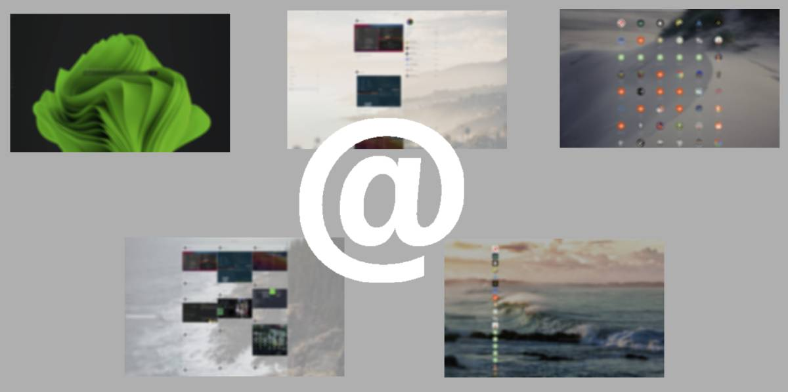

<h1>acktic.github.io</h1>

 

&emsp;&emsp;

### About

  - <em>A Really Simple Syndicate</em>
  - <em>A Enriched Site Summary</em>
  - [Homepage](https://acktic.github.io "Homepage") Github Pages
  - [Heroku](https://acktic.herokuapp.com "Heroku") Node.js Instance
  - [Allowed](http://ack.allowed.org "Allowed") <em>[Freedns domain](https://freedns.afraid.org/)</em>

### Use

  <em>Navigate index.html in your browser locally</em> 
  `node app.js` <em>web server @ localhost:3000</em>

## Init

  `index.html/?q=[unique-id]` 
  `index.html/?q=[category]` 
  `index.html/?[hash]` 

## Features

  
<em>Extended custom urls</em>

  
<em>Youtube Videos Images</em>

  
<em>Custom device Media Queries</em>

  
<em>Interactive sidebar</em>

  
<em>Dynamic theme engine</em>

  
<em>Reader with scrollTo</em>

  
<em>Single Post Display</em>

  
<em>Single Post nsfw API</em>

  
<em>Safe Search</em>

  
<em>Cors Proxy</em>

  
<em>nsfw API</em>

  
<em>Horizontal Scrolling</em>

  
<em>MIT License (free)</em>

  
<em>List Block view</em>

  
<em>Single word search engine</em>

  
<em>Extensive image parsing</em>

  
<em>Tap click links to articles</em>

  
<em>Time date timestamp formating</em>

  
<em>Advanced settings easy config</em>

  
<em>Different loading animations</em>

  
<em>Easily deployable node server</em>

  
<em>Cross browser device tested</em>

  
<em>Chron job daily live feeds</em>

  
<em>Download images directly</em>

  
<em>Post hashes selectable</em>

  
<em>Interactive background selection</em>

  
<em>Notifications</em>

  
<em>Social Badges</em>

  
<em>Croppable images</em>

  
<em>Title filter unwanted ads</em>

  
<em>Base64 image source inspected</em>

### Settings

<em>Located in</em> `site/js/settings.js` <em> edit everything !</em> 
&emsp;-<em>flag flexBox to false for legacy</em>

### Optional

<em>presuming `git`, `heroku-cli`, `npm` are installed</em>

<em>deploy your own cors-anywhere on heroku</em> 
`git clone https://github.com/Rob--W/cors-anywhere.git` 
`cd cors-anywhere/` 
`npm install` 
`heroku create` 
`git push heroku master` 

<em>deploy your own nsfw-api on heroku</em> 
`git clone https://github.com/EugenCepoi/nsfw_api` 
`heroku container:login` 
`heroku create YOUR_APP_NAME` 
`heroku container:push web --app YOUR_APP_NAME` 
`heroku container:release web --app YOUR_APP_NAME` 

Want to Contribute?
----

Add some Assets! 
Create Themes! 
Cleanup Code! 
File Issues! 

Copyright Notice
----

<em>Images and information retrieved and or displayed in project  are not owned by the developers, and are only non - consent</em>

### Notice

  This project makes requests to external resources 
  including a cors-proxy, nsfw api, and any asset(s)

License
----

MIT
